## Problem 5.3

### a. FCFS
$P_1$ takes 8 units
$P_2$ takes (8-0.4)+4 = 11.6 units
$P_3$ takes (8+4-1)+1 = 12 units

average turnaround time = (8+11.6+12)/3= **10.53 units**
### b. SJF
$P_1$ takes 8 units
$P_3$ takes (8-1)+1 = 8 units
$P_2$ takes (8+1-0.4)+4 = 12.6 units

average turnaround time = (8+8+12.6)/3= **9.53 units**
### c. SJF & idle for first unit
$P_3$ takes 1 units
$P_2$ takes (1+1-0.4)+4 = 5.6 units
$P_1$ takes (1+1+4)+8 = 14 units

---

average turnaround time = (1+5.6+14)/3= **6.86 units**
## Problem 5.4

### a. Gantt charts
Following algorithm:
* FCFS
* SJF
* non-preemptive priority
* RR

```mermaid
gantt
    title FCFS
    dateFormat  s
    axisFormat  %S
    section P1
    P1 : 0, 2s
    section P2
    P2 : 2, 1s
    section P3
    P3 : 3, 8s
    section P4
    P4 : 11, 4s
    section P5
    P5 : 15, 5s
```

```mermaid
gantt
    title SJF
    dateFormat  s
    axisFormat  %S
    section P2
    P2 : 0, 1s
    section P1
    P1 : 1, 2s
    section P4
    P4 : 3, 4s
    section P5
    P5 : 7, 5s
    section P3
    P3 : 12, 8s
```

```mermaid
gantt
    title non-preemptive priority
    dateFormat  s
    axisFormat  %S
    section P3
    P3 : 0, 8s
    section P5
    P5 : 8, 5s
    section P1
    P1 : 13, 2s
    section P4
    P4 : 15, 4s
    section P2
    P2 : 19, 1s
```

```mermaid
gantt
    title RR(quantum=2)
    dateFormat  s
    axisFormat  %S
    section P1
    P1 : 0, 2s
    section P2
    P2 : 2, 1s
    section P3
    P3 : 3, 2s
    P3 : 9, 2s
    P3 : 15,2s
    P3 : 18,2s
    section P4
    P4 : 5, 2s
    P4 : 11,2s
    section P5
    P5 : 7, 2s
    P5 : 13,2s
    P5 : 17,1s
```

### b. turnaround time
| unit(second) | FCFS | SJF | Non-Preemptive Priority |  RR  |
|:------------:|:----:|:---:|:-----------------------:|:----:|
|    $P_1$     |  2   |  3  |           15            |  2   |
|    $P_2$     |  3   |  1  |           20            |  3   |
|    $P_3$     |  11  | 20  |            8            |  20  |
|    $P_4$     |  15  |  7  |           19            |  13  |
|    $P_5$     |  20  | 12  |           13            |  18  |
|   Average    | 10.2 | 8.6 |           15            | 11.2 |
### c. waiting time
| unit(second) | FCFS | SJF | Non-Preemptive Priority | RR  |
|:------------:|:----:|:---:|:-----------------------:|:---:|
|    $P_1$     |  0   |  0  |           13            |  0  |
|    $P_2$     |  2   |  1  |           19            |  2  |
|    $P_3$     |  3   | 12  |            0            | 12  |
|    $P_4$     |  11  |  3  |           15            |  9  |
|    $P_5$     |  15  |  7  |            8            | 12  |
|   Average    | 6.2  | 4.6 |           11            |  7  |
### d. minimum average waiting time
in part c. we can see the **minimum average waiting time is 4.6** which is **SJF algorithm** in this case.

---

## Problem 5.6

Move process between various queues with different time-quantum size can make a implementation of aging

1. can solve starvation problem
2. FCFS lower the average turnaround time 
3. Solve the propblem of fixed time-quatum size
    * large time-quatum : waste time for short burst time task
    * small time-quatum : too many interrupts
4. In short, it can make RR more efficient.

---
## Problem 5.7

### a. Priority & SJF
SJF is Priority Scheduling which the shortest job has the highest priority.
### b. Multilevel feedback queues & FCFS
FCFS is Multilevel queues when it only have 1 queue which is using FCFS.
### c. Priority & FCFS
FCFS is Priority Scheduling which all the priority of processes is the same.
### d. RR & SJF
they both have preemptive scheduling.

---

## Problem 5.8

This algorithm favor I/O-bound programs because they use less CPU resources(Process time).

In CPU-bound programs, the one never get schedule in would be execute first. So it won't starve these programs.

---

## Problem 5.10

|       | CPU usage | Priority |
|:-----:|:---------:|:--------:|
| $P_1$ |    40     |    80    |
| $P_2$ |    18     |    69    |
| $P_3$ |    10     |    65    |

CPU-bound process use more CPU resources.
But if it use more CPU resources it would get lower priority(higher priorty number), resulting to **lower the relative priority** of a CPU-bound process.

## Problem 5.22

tasks:
* 10 I/O-bound 
* 1  CPU-bound

### a. time quantum is 1 ms
* I/O operations totally task need 10 ms
* Get different I/O opertation every ms(Need CPU to compute)
    * for both I/O-bound job or CPU-bound job, takes 1 ms to do work (use CPU)
    * 0.1ms to do context-switch

$\cfrac{10}{1.1}=90.9\%$

CPU utilization is **90.9%**

### b. time quantum is 10 ms

* switch all I/O tasks 
    * 1.1 * 10
* CPU task and switch
    * 10.1

$\cfrac{20}{(1.1*10+10.1)}=94.78\%$

CPU utilization is **94.78%**
